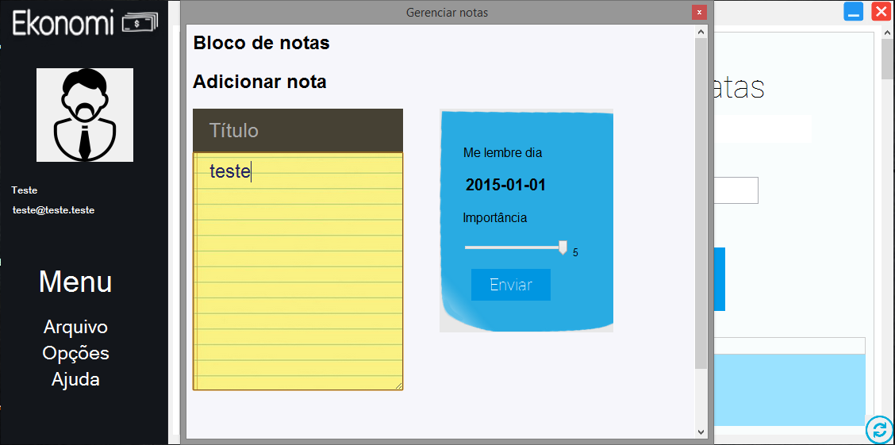
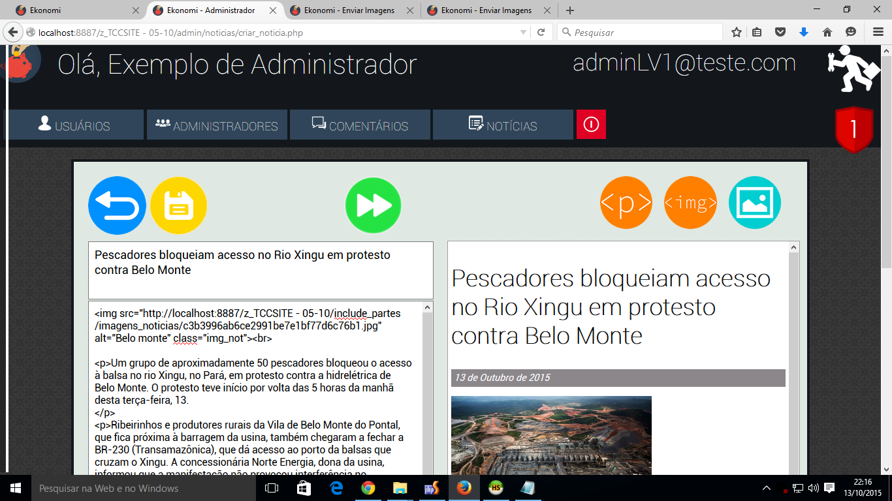
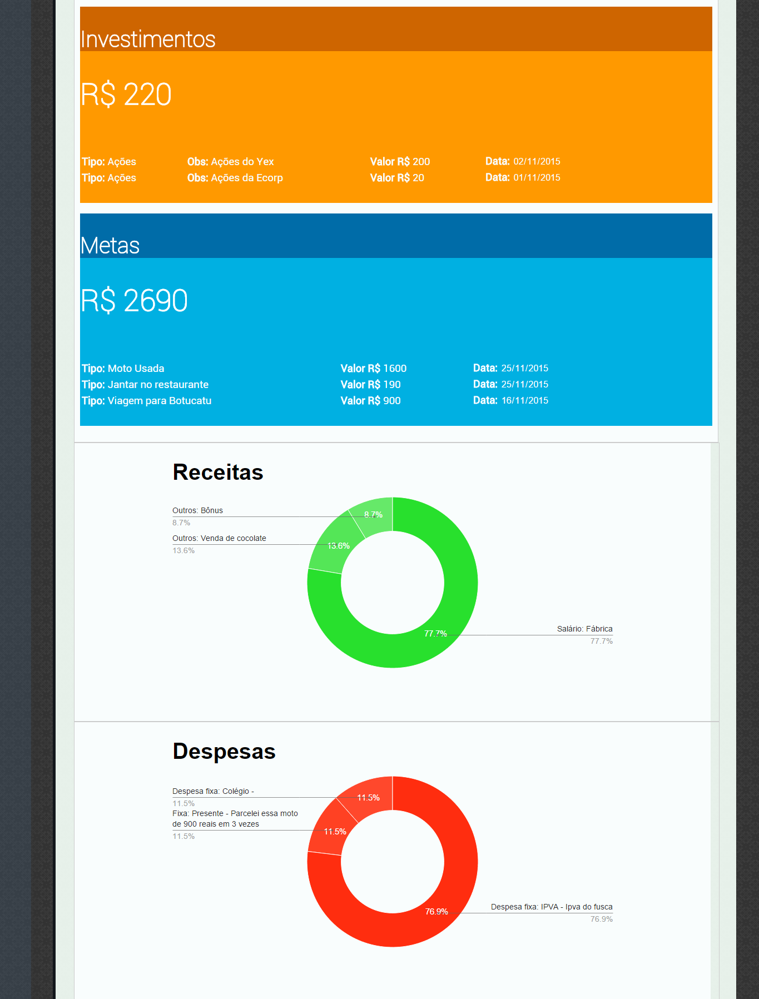

# Ekonomi - um software para gerenciamento de finanças pessoais

## Desenvolvido por

* Ana Beatriz Ribeiro Ferraro
* Ana Paula Santos Dutra da Silva
* [André Luiz Rodrigues Estevam](https://github.com/ALREstevam)
* [Bárbara Oliveira da Silva](https://github.com/Barbara-Oliveira)
* [Leonardo Martins de Oliveira](https://github.com/LeoMartinsBDS)

Como trabalho de conclusão do curso Técnico em Informática da ETEC Polivalente de Americana no ano de 2015.

## Tecnologias utilizadas

* C#
* MySql
* PHP
* HTML
* CSS
* Javascript
* Edição de imagens com Photoshop

# Prints - Software desktop

# Prints - Plataforma web

